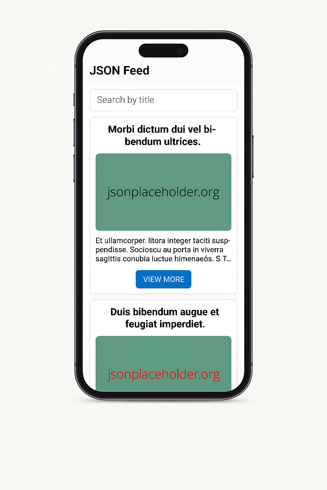
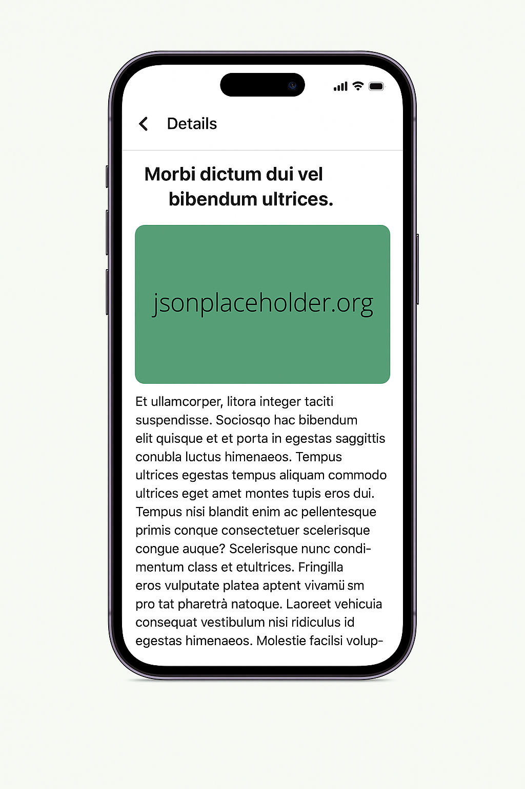

# 📱 jsonFeedApp

A React Native mobile app that fetches and displays a list of JSON posts with support for search, infinite scroll, and detailed views.

## 🚀 Features

- Fetches JSON data from [JSONPlaceholder](https://jsonplaceholder.org/posts)
- Displays posts in a list using `FlatList`
- Search Bar
- Highlighting matched search terms in results
- Infinite Scroll Pagination
- Pull-to-Refresh to reload the data
- Detail View Navigation
- Local caching with AsyncStorage for offline access
- Offline detection with automatic fallback to cached data
- Optimized with `useMemo` & `FlatList`
- Clean Code and Responsive UI

## 📂 Project Structure

```
jsonFeedApp/src/
├── components/
│   ├── PostCard.tsx       # Renders each post in a card format
│   └── SearchBar.tsx      # Search input with debounce
├── screens/
│   ├── HomeScreen.tsx     # Main screen with list + search
│   └── DetailScreen.tsx   # Detailed view for a single post
├── types/
│   └── index.ts           # TypeScript types for posts and navigation
├── utils/
│   └── fetchPosts.ts      # API call logic (mock or real)
├── App.tsx                # Root component with navigation
```

## 📱 Screenshots

### 🏠 Home Screen


### 📄 Detail Screen


## 🛠 Tech Stack

- **React Native**
- **TypeScript**
- **Javascript**
- **React Navigation**
- **Functional Components & Hooks**

## 📦 Installation & Running

### Prerequisites

- Node.js
- React Native CLI
- Android Studio or Xcode (for emulator/device)

### 1. Clone the Repository
```bash
git clone https://github.com/ronneb-dev/jsonFeedApp.git
cd jsonFeedApp
```

### 2. Install Dependencies
```bash
npm install
```

### 3. Run on Android or iOS
```bash
npx react-native run-android  # or run-ios
```

> Make sure you have the React Native CLI and environment set up: https://reactnative.dev/docs/environment-setup

## 📃 License

[MIT](LICENSE)

---

### Made with ❤️ using React Native